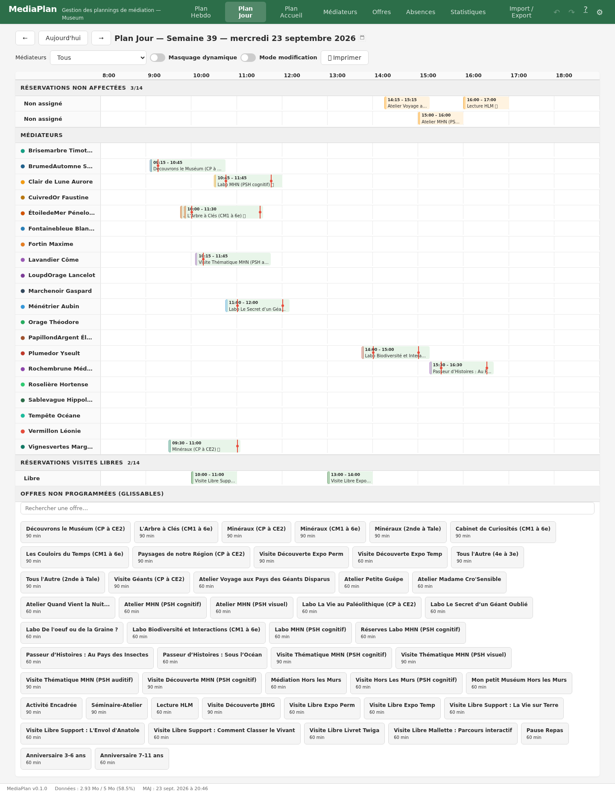
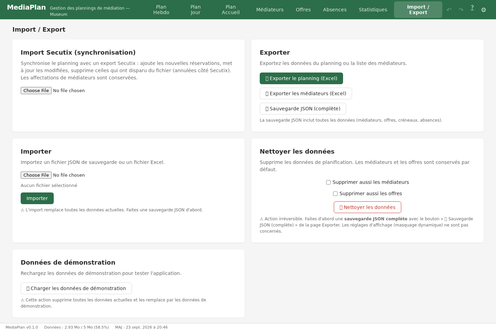

# Documentation utilisateur — MediaPlan

## 1. Concepts clés

Avant de manipuler le planning, cinq notions suffisent pour comprendre l'application.

### Les objets du planning

- **L'offre** : une activité proposée au public (visite guidée, atelier, spectacle…). Chaque offre a une **durée** (celle du public), une capacité, un lieu, une couleur, et des **durées de mise en place / rangement** qui s'ajoutent avant et après. Le **type d'accueil** précise si elle se déroule **libre** (aucun médiateur requis), **réservée encadrée** ou **en animation par un médiateur**.
- **La réservation (créneau)** : une instance datée d'une offre, avec ses horaires, son groupe, et un ou plusieurs médiateurs. C'est l'unité de base du planning. Une réservation est soit **importée** de Secutix (bandeau d'entrée dans le planning), soit **manuelle** (créée directement dans l'application).
- **Le médiateur** : un membre de l'équipe qui anime les offres. Il a une **couleur** (représentée partout par un point ●), des **compétences** par offre (✅ confirmé, 📚 en formation), et un statut actif/inactif.
- **L'absence** : une indisponibilité d'un médiateur (congé, mission, formation, maladie…), à la journée ou la demi-journée. Les absences s'affichent en fond du planning et font passer les créneaux concernés en « Indisponibilité ».

### Les données restent sur votre poste

Toutes les données (planning, médiateurs, offres, absences) sont stockées **dans le navigateur de votre poste de travail** — MediaPlan n'envoie rien vers un serveur et ne sort jamais les données de l'ordinateur. Il n'y a **pas de synchronisation automatique** entre plusieurs postes.

Pour **travailler à plusieurs ou changer de poste**, passez par la sauvegarde :

1. Sur le poste source : vue **Import / Export** → **Exporter** → un fichier `.json.gz` daté est téléchargé
2. Transmettez ce fichier à l'autre poste (mail, clé USB…)
3. Sur le poste cible : vue **Import / Export** → **Importer** → sélectionnez le fichier — l'application vous avertit si la sauvegarde importée est plus ancienne que vos données locales
4. Le planning de l'autre poste remplace celui du poste ; ré-exportez après vos modifications si le travail doit revenir au poste d'origine

⚠️ Une seule personne travaille à la fois sur une version des données — l'import **remplace** tout, il ne fusionne pas. Faites une exportation avant chaque import pour pouvoir revenir en arrière.

### Le verrouillage

Le planning est **verrouillé par défaut** : les réservations importées de Secutix ne peuvent pas être modifiées dans leur offre, leur date ou leurs horaires. Le verrou **ne bloque pas** l'assignation des médiateurs, ni le catalogue d'offres, ni les durées de mise en place/rangement par créneau. Déverrouillez (toggle « Mode modification ») uniquement pour toucher aux horaires — une confirmation est demandée, et une réservation importée modifiée est marquée « ✏ Modifié après import ».

### Les états du planning

Chaque créneau porte un **état unique**, visible en vue Hebdo (couleur + symbole) — voir le tableau au chapitre 2. Dans l'ordre de gravité : ❌ à assigner, 🚫 indisponibilité, ⚠️ incompétent, 📚 en apprentissage, ✔️ OK. Les créneaux des offres **libres** sont toujours verts, même sans médiateur.

---

## 2. Prise en main — le workflow

La gestion du planning se fait en quatre temps : **repérer**, **assigner**, **vérifier**, **protéger**.

### Étape 1 — Repérer ce qui demande une action (vue Hebdo)

La vue **Plan Hebdo** est votre tableau de bord : chaque créneau porte une **couleur et un symbole d'état**.

*Le tableau de bord : à gauche le badge de compteurs par état, chaque créneau coloré selon sa gravité, la légende en bas de grille.*

| Symbole | État | Signification | Gravité |
|---------|------|---------------|---------|
| ❌ | À assigner | réservation sans médiateur | 🔴 la plus urgente |
| 🚫 | Indisponibilité | le médiateur assigné est absent ou a un chevauchement | 🔴 |
| ⚠️ | Incompétent | aucun médiateur assigné n'est compétent sur l'offre | 🟠 warning |
| 📚 | En apprentissage | aucun médiateur confirmé, mais un en formation | 🟡 info |
| ✔️ | OK | au moins un médiateur disponible et confirmé | 🟢 |

- Le **badge compteur** dans la barre d'outils totalise chaque état pour la semaine affichée
- La **légende** sous la grille rappelle les couleurs et symboles
- **Survolez un créneau** : le tooltip affiche l'offre, l'horaire, l'état, les médiateurs concernés et l'origine
- Changer de semaine : flèches **← →**, bouton **Aujourd'hui**, ou **clic sur la période** (sélecteur de date)

### Étape 2 — Assigner les médiateurs (vue Jour)

La vue **Plan Jour** est la vue de travail : un médiateur par ligne, le temps en colonnes.

*La vue de travail : les noms de médiateurs (avec leur pastille de couleur) à gauche, les créneaux positionnés dans le temps, la bande des offres non programmées en bas de page.*

Tous les moyens d'affecter une offre sont détaillés au **chapitre 4**.

### Étape 3 — Vérifier et corriger

- Cliquez sur un créneau pour l'ouvrir :
  - **planning verrouillé** : formulaire restreint — assignation de médiateurs, participants, statut, notes, et **durées de mise en place / rangement** (ajustables sans déverrouiller)
  - **planning déverrouillé** : édition complète (offre, date, horaires, suppression)
- Les avertissements en direct dans le formulaire signalent les **chevauchements** et les **absences**
- Dans la vue Hebdo, un créneau devient ✔️ dès qu'au moins un médiateur assigné est disponible **et** confirmé sur l'offre
- Compétences : visibles dans le sélecteur de médiateurs (✅ confirmé, 📚 en formation, ⚠️ incompétent)

### Étape 4 — Protéger le planning

- Le planning est **verrouillé par défaut** : les réservations importées (Secutix) ne peuvent pas être modifiées dans leur durée ou leur horaire
- Le verrou **ne bloque pas** l'assignation de médiateurs, ni le catalogue d'offres (création/modification/suppression toujours possibles)
- Déverrouillez (toggle « Mode modification ») uniquement pour toucher aux horaires — une confirmation est demandée
- Une réservation importée modifiée est marquée « ✏ Modifié après import » (traçabilité)

---

## 3. Gérer les médiateurs

La vue **Médiateurs** est le référentiel de l'équipe.

*Le référentiel des médiateurs : tri par colonne, recherche, pastille de couleur et compétences par médiateur.*

- **Ajout / modification / suppression** via les boutons d'action du tableau
- **Couleur** : pastille attribuée à chaque médiateur, affichée partout (planning, tableaux, formulaires) comme un point ●
- **Compétences** : par offre, avec un statut — ✅ **confirmé** (peut animer seul), 📚 **en formation** (peut être assigné en complément pour apprendre, ou exceptionnellement seul si aucun confirmé n'est disponible)
- **Statut actif/inactif** : un médiateur inactif disparaît du planning sans être supprimé (utile pour les départs)
- **Tri par colonne**, **recherche texte**, filtre **« Actifs seulement »**

Les compétences déterminent l'aide à l'assignation (chapitre 4) : le sélecteur de médiateurs d'une réservation trie d'abord les confirmés, puis les en formation, puis les autres.

---

## 4. Affecter les offres — tous les moyens

Il y a **quatre façons** d'affecter une offre à un médiateur, toutes dans la vue Jour. Pendant le glisser, une **barre rouge** affiche en temps réel l'horaire de réservation visé.

*Pendant le glisser : la barre rouge pointillée indique la réservation visée (arrondie à 10 min) et sa durée totale — la mise en place s'étend avant, le rangement après.*

### a) Glisser une offre du catalogue sur un médiateur (création)

Glissez une offre depuis le bandeau « Offres non programmées » sur la ligne d'un médiateur :

- la position du curseur définit le **début de la réservation** (arrondi à 10 minutes, affiché en temps réel dans la barre rouge)
- les **durées de mise en place / rangement** de l'offre s'étendent avant/après (elles ne comptent PAS dans la réservation)
- le bloc total est dessiné avec des **traits rouges** marquant le début et la fin de la vraie réservation
- le créneau créé est **manuel** — l'offre reste dans le bandeau pour un nouvel usage

### b) Glisser une réservation non affectée sur un médiateur (assignation)

Les réservations importées sans médiateur s'affichent dans la **bande du haut** de la vue Jour. Glissez-en une sur la ligne d'un médiateur pour l'assigner : l'horaire ne change pas, seul le médiateur est ajouté.

### c) Glisser un créneau d'une ligne à l'autre (réassignation)

Un créneau déjà assigné peut être glissé vers la ligne d'un autre médiateur. Le glisser d'un créneau **ajoute** un médiateur à la réservation (affectation multiple, utile pour la formation) — utilisez le formulaire (d) pour retirer un médiateur.

### d) Le formulaire de réservation (précis)

Cliquez sur un créneau (ou videz le drag pour le rouvrir) :

- le **sélecteur de médiateurs** est trié par compétence : ✅ confirmés d'abord, 📚 en formation ensuite, ⚠️ incompétents en dernier — recherche par nom incluse
- sélection multiple possible (affectation multiple, formation)
- le formulaire signale en direct les **chevauchements** et les **absences** du médiateur choisi

### Aides à l'assignation

- **Masquage dynamique** (toggle dans la barre d'outils, désactivé par défaut) : pendant le glisser d'une offre ou d'une réservation à affecter, masque les lignes des médiateurs totalement incompétents pour l'offre
- **Surlignage de compétence** : dès qu'une offre est sélectionnée ou glissée, les lignes de médiateurs prennent un fond **bleu** (confirmé), **jaune** (en formation) ou **hachuré** (incompétent)
- **Filtre Médiateurs** (barre d'outils) : *Libres* (aucun créneau ni absence ce jour-là), *Occupés*, *Tous*, ou un médiateur précis
- **Recherche d'offre** : champ texte au-dessus des offres non programmées, insensible à la casse
- **Créneaux en parallèle** : des réservations qui se chevauchent dans les bandes (non affectées, visites libres) s'affichent côte à côte dans des couloirs parallèles
- **Visites libres** : glissez-les pour les déplacer — elles n'exigent pas de médiateur
- **🖨️ Imprimer** : la vue du jour sur une page A4 paysage — les lignes de médiateurs sans rien ce jour-là sont masquées, les bandes de réservations non affectées et de visites libres sont incluses, l'en-tête affiche la semaine et la date

---

## 5. Imports & sauvegardes

*L'import Secutix, l'export JSON.gz et le nettoyage des données dans une seule vue.*

### Import Secutix (les réservations du public)

- Chargez l'export « visitPlanning » depuis Secutix
- Les réservations sont **rapprochées des offres par leur libellé Secutix** — une offre du catalogue doit exister avec le même libellé
- Les créneaux **supprimés de Secutix** sont retirés du planning (l'action est annulable)
- Un **undo** complet est proposé après l'import (« Annuler l'import ») tant que la page n'a pas été fermée
- Les lignes « Droit d'accès » (droits d'entrée) sont ignorées
- Les réservations importées sont **protégées par le verrou** (chapitre 1)

### Sauvegarde et partage entre postes

Comme les données ne sortent jamais du poste (chapitre 1), la sauvegarde est le seul canal de partage :

- **Export JSON.gz** : sauvegarde compressée avec date dans le nom de fichier — à partager entre coordinatrices ou changer de poste
- **Import** : restauration complète — l'application vous **avertit si la sauvegarde est plus ancienne** que vos données locales (comparaison des dates de dernière modification)
- ⚠️ L'import **remplace** toutes les données, il ne fusionne pas : exportez avant d'importer

### Nettoyage et démonstration

- **Nettoyer les données** : supprime les réservations, absences et plannings ; optionnellement aussi les médiateurs et les offres (cases à cocher) — double confirmation et sauvegarde JSON recommandée avant
- **🔄 Reset** : régénère les données de démonstration (~15 mois, tous les états de planning représentés)

---

## 6. Les autres vues

### Plan Accueil

La liste chronologique des réservations du jour — le « récapitulatif d'accueil » : un bandeau par réservation avec ses médiateurs et le détail complet style Secutix (site, espace, horaires, effectif et nature du groupe, dossier client, mise en place/rangement).

- Les **visites libres** ont leur propre section en bas (« Réservations visites libres »)
- Un bandeau indique **« Non assigné »** quand aucun médiateur n'est affecté
- Cliquez un bandeau pour ouvrir la réservation
- **🖨️ Imprimer** : tous les bandeaux du jour sur une page A4 paysage (en-tête semaine + date, date d'impression en pied)

### Statistiques

Choisissez une **période** en haut de page (dates début/fin, ou boutons rapides : Ce mois, Mois dernier, 30 derniers jours, Année en cours), puis naviguez entre trois onglets :

- **Médiateurs** : nombre d'animations, temps cumulé, absences, offres réalisées (« nom × N »), charge hebdomadaire avec total d'heures — triés par durée cumulée décroissante ; les médiateurs inactifs avec créneaux sont inclus
- **Réservations** : classement des offres par nombre de réservations (barres alignées : nombre, durée cumulée, effectifs en candlestick min/médiane/moyenne/max), survol pour le détail et le surlignage croisé ; réservations par jour de semaine ; **total des visiteurs par nature de groupe**
- **Visites** : visites libres vs accompagnées (camembert), effectifs cumulés dans la période, répartition par nature au cours du temps, candlestick des effectifs par nature et par jour de semaine

Les statistiques portent sur **toutes les réservations** de la période, visites libres incluses (une réservation peut être une visite libre, sans accompagnement) ; les réservations annulées sont exclues.

### Offres

- Catalogue des activités : durée (celle du public), capacité, lieu, **couleur**
- **Type d'accueil** : « Accueil libre » (offre sans médiateur requis — ses créneaux s'affichent verts même sans assignation), « Réservable encadrée par médiateur », « Animation par médiateur »
- **Mise en place / rangement** : durées logistiques par défaut en minutes — utilisées par les créneaux, modifiables à tout moment
- Tri par colonne et recherche

*Le catalogue des offres : recherche, tri par colonne, et les actions ✏ modifier / 🗑 supprimer — disponibles même planning verrouillé.*

*Le formulaire d'offre : la « Durée » est celle du public ; « Mise en place » et « Rangement » sont les durées logistiques par défaut reprises par les créneaux.*

### Absences

- Congés, missions, formations, maladie, autres, **souhaits de congés** (bleu)
- **Demi-journées** : matin / après-midi, frontières configurables (⚙️ dans le header)
- Tri par colonne, filtre par médiateur, toggle « Absences passées »
- Affichées dans les deux vues de planning (bandes de fond dans la vue Jour, bannières dans la vue Hebdo)

*Les absences : tri par colonne, filtre par médiateur, et le toggle « Absences passées » pour masquer l'historique.*

---

## 7. Lexique

| Terme | Signification |
|-------|---------------|
| **Offre** | Activité proposée au public (visite guidée, atelier…), avec durée, capacité, lieu et durées logistiques |
| **Réservation / créneau** | Une offre à une date et une heure données, avec son groupe et ses médiateurs — l'unité de base du planning |
| **Réservation importée** | Réservation venue de Secutix (marquée 📥), protégée par le verrou |
| **Réservation manuelle** | Créneau créé directement dans l'application (marqué ✋) |
| **Médiateur** | Membre de l'équipe qui anime les offres ; sa couleur apparaît partout sous forme de point ● |
| **Compétence** | Savoir-faire d'un médiateur sur une offre : ✅ confirmé (peut animer seul) ou 📚 en formation (en acquisition) |
| **Absence** | Indisponibilité d'un médiateur (congé, mission, formation, maladie, autre), jour ou demi-journée |
| **Mise en place / rangement** | Temps de préparation avant et de remise en état après la réservation — hors durée du public |
| **Type d'accueil** | Mode de gestion d'une offre : libre (sans médiateur), réservée encadrée, ou animation |
| **Visite libre** | Réservation d'une offre à type d'accueil « Accueil Libre » — aucun médiateur requis, toujours verte |
| **Offres non programmées** | Le catalogue glissable en bas de la vue Jour, pour créer des créneaux manuels |
| **État du planning** | Diagnostic unique d'un créneau : ❌ à assigner, 🚫 indisponibilité, ⚠️ incompétent, 📚 en apprentissage, ✔️ OK |
| **Verrouillage** | Mode par défaut protégeant les horaires des réservations importées ; l'assignation reste toujours libre |
| **Modifié après import** | Marque ✏ signalant une réservation importée dont les horaires ont été changés après déblocage |
| **Secutix** | Le système de billetterie du musée d'où viennent les réservations du public (export « visitPlanning ») |
| **Sauvegarde JSON.gz** | Fichier compressé de toutes les données, pour archiver ou transférer vers un autre poste |

---

## 8. Raccourcis clavier & URLs

### Raccourcis clavier

- **Ctrl+Z** : Annuler
- **Ctrl+Shift+Z** : Rétablir

### Liens et URLs

- `?display=day&date=2026-10-08` — vue Jour sur une date précise
- `?display=week&date=2026-10-08` — vue Hebdo contenant cette date
- `?display=reservations` — Plan Accueil du jour
- `?display=stats` — Statistiques
- Sans paramètre : vue Jour, aujourd'hui

---

## 🎨 Repères visuels

- **● point coloré** : couleur du médiateur (partout : planning, tableaux, formulaires)
- **Pills colorées** : offres
- **Bandeaux de fond** : absences (couleur selon le type)
- **Traits rouges** : début/fin de la vraie réservation dans un bloc avec mise en place/rangement
- **Bordure gauche double** : réservation importée (Secutix)

---

*Documentation mise à jour avec la version 0.1.0. Le bandeau de statut en bas de page affiche la version courante, l'espace utilisé et la date de dernière modification des données.*
