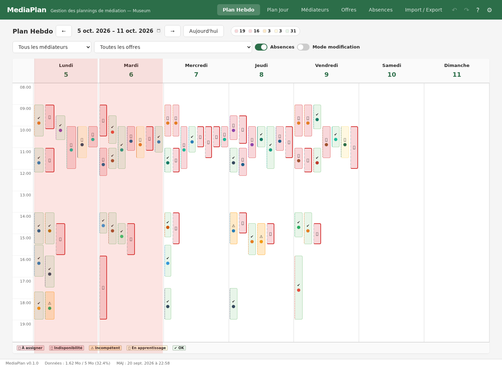
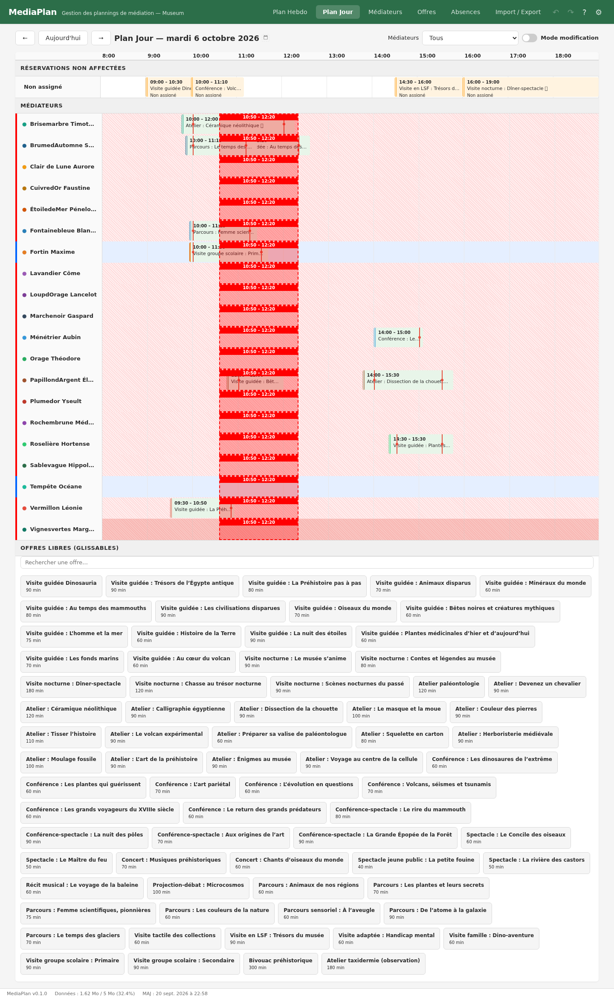
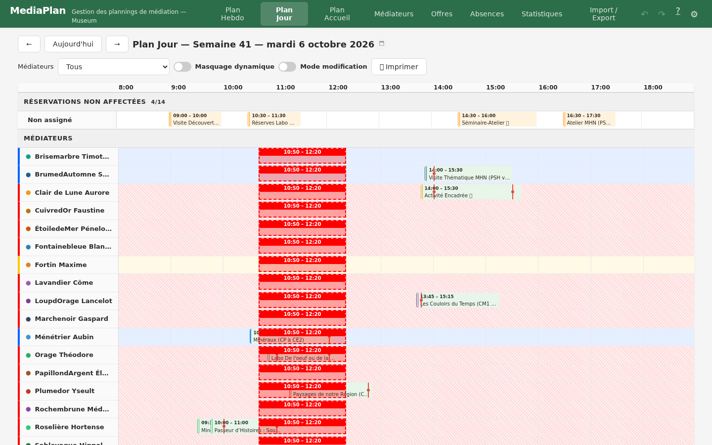
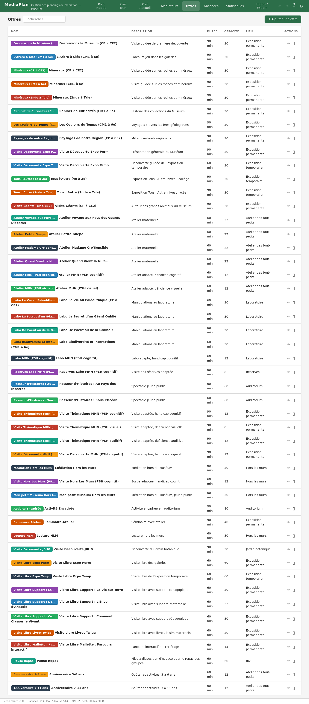
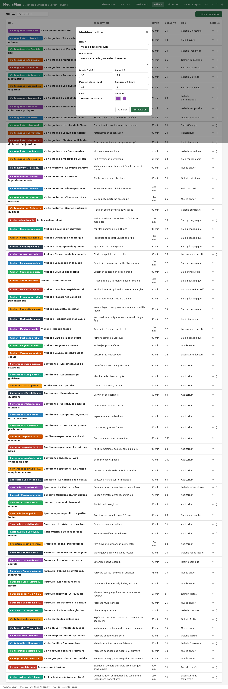
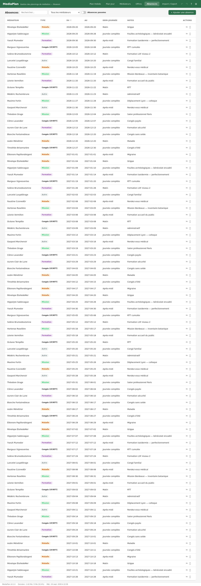

# Documentation utilisateur — MediaPlan

## 📌 Accès rapide

- **Bouton "?"** dans le header → ouvre la documentation
- **Bandeau de statut** (bas de page) : version de l'application, espace utilisé, date de dernière mise à jour des données

---

## 🗓️ Gérer le planning — le workflow

La gestion du planning se fait en quatre temps : **repérer**, **assigner**, **vérifier**, **protéger**.

### Étape 1 — Repérer ce qui demande une action (vue Hebdo)

La vue **Plan Hebdo** est votre tableau de bord : chaque créneau porte une **couleur et un symbole d'état**.

*Le tableau de bord : à gauche le badge de compteurs par état, chaque créneau coloré selon sa gravité, la légende en bas de grille.*

| Symbole | État | Signification | Gravité |
|---------|------|---------------|---------|
| ❌ | À assigner | réservation sans médiateur | 🔴 la plus urgente |
| 🚫 | Indisponibilité | le médiateur assigné est absent ou a un chevauchement | 🔴 |
| ⚠️ | Incompétent | aucun médiateur assigné n'est compétent sur l'offre | 🟠 warning |
| 📚 | En apprentissage | aucun médiateur confirmé, mais un en formation | 🟡 info |
| ✔️ | OK | au moins un médiateur disponible et confirmé | 🟢 |

- Le **badge compteur** dans la barre d'outils totalise chaque état pour la semaine affichée
- La **légende** sous la grille rappelle les couleurs et symboles
- **Survolez un créneau** : le tooltip affiche l'offre, l'horaire, l'état, les médiateurs concernés et l'origine
- Changer de semaine : flèches **← →**, bouton **Aujourd'hui**, ou **clic sur la période** (sélecteur de date)

### Étape 2 — Assigner les médiateurs (vue Jour)

La vue **Plan Jour** est la vue de travail : un médiateur par ligne, le temps en colonnes.

*La vue de travail : les noms de médiateurs (avec leur pastille de couleur) à gauche, les créneaux positionnés dans le temps, la bande des offres libres en bas de page.*

**Glisser une offre** : pendant le glisser, une **barre rouge** affiche en temps réel l'horaire de réservation visé.

*Pendant le glisser : la barre rouge pointillée indique la réservation visée (arrondie à 10 min) et sa durée totale — la mise en place s'étend avant, le rangement après.*

- **Glisser une offre** depuis le bandeau « Offres libres » sur la ligne d'un médiateur :
  - la position du curseur définit le **début de la réservation** (arrondi à 10 minutes, affiché en temps réel dans la barre rouge)
  - les **durées de mise en place / rangement** de l'offre s'étendent avant/après (elles ne comptent PAS dans la réservation)
  - le bloc total est dessiné avec des **traits rouges** marquant le début et la fin de la vraie réservation
- **Glisser une réservation non affectée** (bande du haut) sur un médiateur pour l'assigner
- **Filtre Médiateurs** (barre d'outils) : *Libres* (aucun créneau ni absence ce jour-là), *Occupés*, *Tous*, ou un médiateur précis
- **Recherche d'offre** : champ texte au-dessus des offres libres, insensible à la casse
- Changer de jour : flèches, **Aujourd'hui**, ou **clic sur la date** dans le titre

### Étape 3 — Vérifier et corriger

- Cliquez sur un créneau pour l'ouvrir :
  - **planning verrouillé** : formulaire restreint — assignation de médiateurs, participants, statut, notes, et **durées de mise en place / rangement** (ajustables sans déverrouiller)
  - **planning déverrouillé** : édition complète (offre, date, horaires, suppression)
- Les avertissements en direct dans le formulaire signalent les **chevauchements** et les **absences**
- Dans la vue Hebdo, un créneau devient ✔️ dès qu'au moins un médiateur assigné est disponible **et** confirmé sur l'offre
- Compétences : visibles dans le sélecteur de médiateurs (✅ confirmé, 📚 en formation, ⚠️ incompétent)

### Étape 4 — Protéger le planning

- Le planning est **verrouillé par défaut** : les réservations importées (Secutix) ne peuvent pas être modifiées dans leur durée ou leur horaire
- Le verrou **ne bloque pas** l'assignation de médiateurs, ni le catalogue d'offres (création/modification/suppression toujours possibles)
- Déverrouillez (toggle « Mode modification ») uniquement pour toucher aux horaires — une confirmation est demandée
- Une réservation importée modifiée est marquée « ✏ Modifié après import » (traçabilité)

---

## 📱 Les autres vues

### Médiateurs
- Liste, ajout, modification, suppression ; **couleur** et **compétences** par médiateur
- Tri par colonne, recherche texte, filtre « Actifs seulement »

### Offres
- Catalogue des activités : durée (celle du public), capacité, lieu, **couleur**
- **Type d'accueil** : « Accueil libre » (offre sans médiateur requis — ses créneaux s'affichent verts même sans assignation), « Réservable encadrée par médiateur », « Animation par médiateur »
- **Mise en place / rangement** : durées logistiques par défaut en minutes — utilisées par les créneaux, modifiables à tout moment
- Tri par colonne et recherche

*Le catalogue des offres : recherche, tri par colonne, et les actions ✏ modifier / 🗑 supprimer — disponibles même planning verrouillé.*

*Le formulaire d'offre : la « Durée » est celle du public ; « Mise en place » et « Rangement » sont les durées logistiques par défaut reprises par les créneaux.*

### Absences
- Congés, missions, formations, maladie, autres, **souhaits de congés** (bleu)
- **Demi-journées** : matin / après-midi, frontières configurables (⚙️ dans le header)
- Tri par colonne, filtre par médiateur, toggle « Absences passées »
- Affichées dans les deux vues de planning (bandes de fond dans la vue Jour, bannières dans la vue Hebdo)

*Les absences : tri par colonne, filtre par médiateur, et le toggle « Absences passées » pour masquer l'historique.*

### Import / Export
- **Export JSON.gz** : sauvegarde compressée avec date dans le nom de fichier — à partager entre coordinatrices
- **Import** : restauration ; un avertissement compare les dates de dernière modification
- **🔄 Reset** : régénère les données de démonstration (~15 mois, tous les états de planning représentés)

---

## ⌨️ Raccourcis clavier

- **Ctrl+Z** : Annuler
- **Ctrl+Shift+Z** : Rétablir

---

## 🔗 Liens et URLs

- `?display=day&date=2026-10-08` — vue Jour sur une date précise
- `?display=week&date=2026-10-08` — vue Hebdo contenant cette date
- Sans paramètre : vue Jour, aujourd'hui

---

## 🎨 Repères visuels

- **● point coloré** : couleur du médiateur (partout : planning, tableaux, formulaires)
- **Pills colorées** : offres
- **Bandeaux de fond** : absences (couleur selon le type)
- **Traits rouges** : début/fin de la vraie réservation dans un bloc avec mise en place/rangement
- **Bordure gauche double** : réservation importée (Secutix)

---

*Documentation mise à jour avec la version 0.1.0. Le bandeau de statut en bas de page affiche la version courante.*
